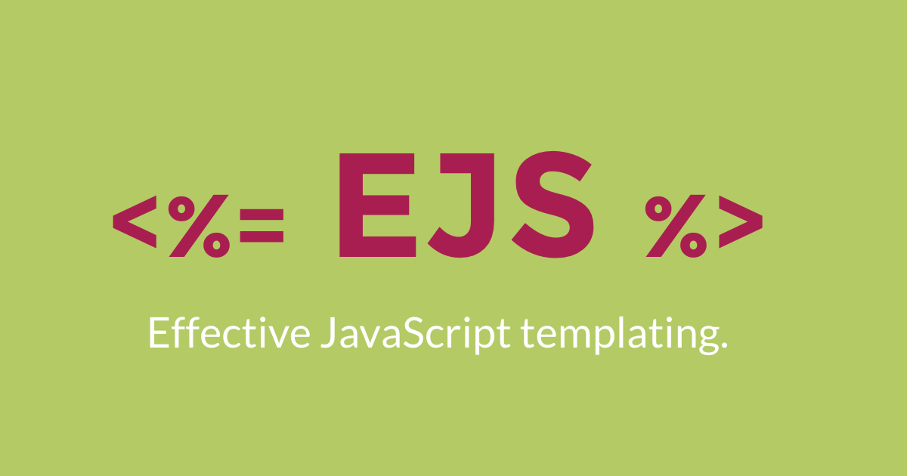

# Daily Journal Web App
# Description
## 
My Daily Journal App to jot down daily thoughts, moments, and reflections with ease.
Visit WebApp: [Daily Journal Web App - v2](https://my-daily-journal-f7xz.onrender.com/).
## 
# Version - 2.0
## Language and Tools: 

